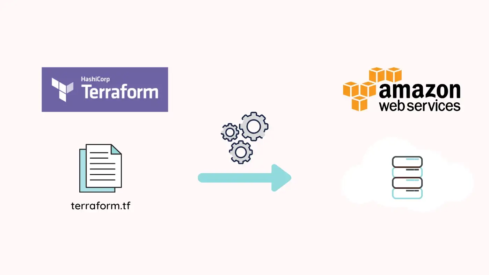

# Deploying AWS Resources using Terraform

This repo contains a basic terraform script `main.tf` that deploys specified AWS resources.

To execute script, run the following command in your terminal (where the script is located):

    terraform init
    terraform apply --auto-approve

